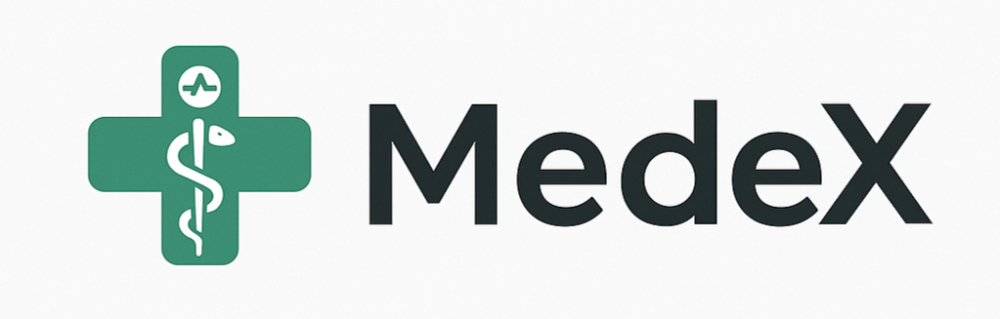

# 🏥 MedeX v25.83 - Sistema Avanzado de IA Médica

<div align="center">



**Sistema médico inteligente con IA avanzada, detección automática de usuarios y protocolos de emergencia**

[](https://www.python.org/downloads/)
[](https://fastapi.tiangolo.com/)
[](https://opensource.org/licenses/MIT)

</div>

---

## 🌟 Acerca de MedeX

MedeX v25.83 es un sistema avanzado de inteligencia artificial médica que utiliza el modelo **Kimi K2-0711-Preview** para proporcionar información médica precisa y contextualizada. El sistema cuenta con:

### ✨ Características Principales

- **🧠 IA Médica Avanzada**: Powered by Kimi K2-0711-Preview
- **👤 Detección Inteligente**: Distingue automáticamente entre profesionales de salud y usuarios educativos
- **🚨 Protocolos de Emergencia**: Reconocimiento automático de emergencias médicas
- **📚 RAG Integrado**: Sistema de recuperación aumentada con base de conocimiento médico
- **⚡ Respuestas en Tiempo Real**: Streaming de respuestas progresivas
- **🎨 UI Moderna**: Interfaz profesional y responsive

### 🎯 Modos de Operación

#### Modo Profesional 👨‍⚕️
Activado automáticamente cuando detecta terminología médica profesional:
- Análisis clínicos detallados
- Diagnósticos diferenciales
- Protocolos de tratamiento basados en evidencia
- Referencias a guías clínicas actualizadas

#### Modo Educativo 📚
Para estudiantes y público general:
- Explicaciones claras y accesibles
- Terminología simplificada
- Énfasis en prevención y educación
- Disclaimers de seguridad apropiados

---

## 🚀 Cómo Usar MedeX

### 1️⃣ Configuración en Hugging Face Spaces

Para usar MedeX, necesitas configurar un **secret** en tu Space:

1. Ve a la configuración de tu Space (Settings)
2. En la sección "Repository secrets", agrega:
   - **Nombre del secret**: `MOONSHOT_API_KEY`
   - **Valor**: Tu API key de [Moonshot AI](https://platform.moonshot.ai/)

### 2️⃣ Obtener API Key

1. Visita [platform.moonshot.ai](https://platform.moonshot.ai/)
2. Crea una cuenta o inicia sesión
3. Genera tu API key en el dashboard
4. Copia la API key y configúrala en los secrets de HF Spaces

### 3️⃣ Usar la Aplicación

Una vez configurado el secret:

1. La aplicación se iniciará automáticamente
2. Haz clic en "Iniciar Consulta"
3. Escribe tu pregunta médica
4. MedeX detectará automáticamente tu perfil y proporcionará la respuesta adecuada

---

## 💡 Ejemplos de Uso

### Para Profesionales de la Salud

```
👨‍⚕️ "Paciente masculino 65 años, diabético, dolor precordial 2 horas de evolución"

📋 MedeX responderá con:
- Análisis diferencial completo
- Protocolos de actuación
- Estudios diagnósticos específicos
- Plan terapéutico basado en guías
- Códigos CIE-10
```

### Para Estudiantes/Público General

```
👤 "¿Qué son los AINEs y para qué sirven?"

📋 MedeX responderá con:
- Explicación clara y educativa
- Ejemplos comunes
- Precauciones importantes
- Cuándo consultar a un profesional
```

### Casos de Emergencia

```
🚨 "Dolor intenso en el pecho que irradia al brazo"

⚠️ MedeX activará protocolo de emergencia:
- Alerta visual destacada
- Instrucciones inmediatas
- Indicación de llamar al 911
- Primeros auxilios básicos
```

---

## 🔧 Tecnologías Utilizadas

- **Frontend**: HTML5, CSS3, JavaScript (ES6+)
- **Backend**: FastAPI, Python 3.8+
- **IA**: Kimi K2-0711-Preview (Moonshot AI)
- **Deployment**: Hugging Face Spaces (Static SDK)
- **UI/UX**: Diseño responsive moderno con gradientes médicos

---

## 📋 Estructura del Proyecto

```
MedeX/
├── index.html          # Interfaz principal
├── styles.css          # Estilos modernos y profesionales
├── script.js           # Lógica del frontend
├── app.py              # API FastAPI backend
├── MEDEX_FINAL.py      # Sistema MedeX core
├── requirements.txt    # Dependencias Python
└── README.md           # Este archivo
```

---

## ⚠️ Disclaimer Importante

**MedeX es una herramienta de apoyo educativo e informativo.**

- ❌ **NO reemplaza** la consulta médica profesional
- ❌ **NO proporciona** diagnósticos médicos definitivos
- ❌ **NO debe usarse** para emergencias reales

### En caso de emergencia real:
- 🚨 Llama al 911 o servicios de emergencia locales
- 🏥 Acude al servicio de urgencias más cercano
- 👨‍⚕️ Consulta con profesionales de la salud certificados

---

## 🔐 Seguridad y Privacidad

- Las conversaciones **NO se almacenan** permanentemente
- Los datos **NO se comparten** con terceros
- La API key se maneja de forma segura a través de secrets de HF
- Sin cookies ni tracking de usuarios

---

## 📖 Documentación Adicional

- [Guía de Usuario Completa](docs/guia_de_usuario.md)
- [User Guide (English)](docs/user_guide.md)
- [GitHub Repository](https://github.com/DeepRatAI/MedeX)

---

## 🤝 Contribuciones

MedeX es un proyecto open-source. Las contribuciones son bienvenidas:

1. Fork el repositorio
2. Crea una rama para tu feature
3. Commit tus cambios
4. Push a la rama
5. Abre un Pull Request

---

## 📄 Licencia

MedeX está licenciado bajo [MIT License](https://opensource.org/licenses/MIT).

---

## 👥 Créditos

- **Desarrollado por**: DeepRatAI
- **Modelo IA**: Kimi K2-0711-Preview (Moonshot AI)
- **Versión**: 25.83
- **Última actualización**: 2024

---

## 📞 Soporte

¿Necesitas ayuda?

- 📧 Issues en GitHub
- 📖 Consulta la documentación
- 💬 Discusiones en la comunidad

---

<div align="center">

**🏥 MedeX v25.83 - Inteligencia Artificial al Servicio de la Medicina**

*Powered by Kimi K2 • Built with ❤️ by DeepRatAI*

</div>
